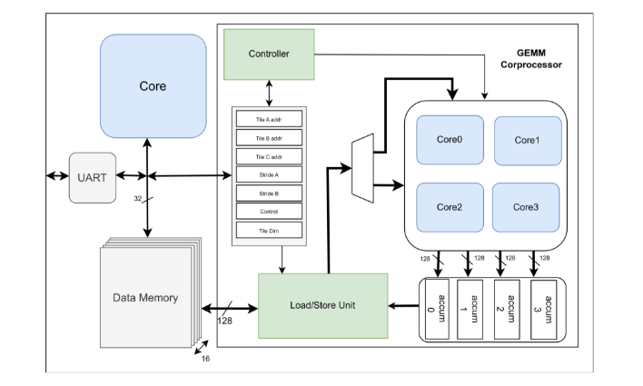

set origin_dir [file dirname [info script]]
create_project ${_xil_proj_name_} $origin_dir/${_xil_proj_name_} -part xc7a100tcsg324-1

# A GEMM (General Matrix Multiplier) Co-processor

This repo is a Martix multiplier Co-processor integrated with a Risc-V 3-stage pipelined processor with separate data memory and UART. Currently, the core implements RV32IMZicsr ISA based on User-level ISA Version 2.0 and Privileged Architecture Version 1.11 supporting only M mode. The following are the key features of the repo:

## Key Features
- 32-bit RISC-V ISA core that supports base integer (I) and multiplication and division (M),  and Zicsr (Z) extensions (RV32IMZicsr) with a custom GEMM Co-processor.
- Supports 8-bit signed input matrix elements and 32-bit signed output matrix elements.
- Supports Dual port data memory of 16 banks that is synthesizable in Vivado.
- Supports user input for Matrix by both data memory and UART.
- Support for rectangular matrices by using Runtime tiling provided by our GEMM.h file.
- Support for performance monitoring in hardware by CSR counters and code.
- Support for importing the repo to Vivado by a TCL file. (board ---> xc7a100tcgs)

### System Design Overview
The GEMM Co-processor is a loosely coupled Co-processor that can be accessed by its memory-mapped registers. We have used a Dual port Memory with a 32 interface with Risc-V core and a 128-bit interface with GEMM for fast load and stores. The GEMM communicates with the core with the 32-bus interface. We define the matrices in Code and their addresses are stored in registers GEMM_A for A matrix, GEMM_B for Matrix B, and GEMM_C for the resultant matrix. The tiling limits are stored in GEMM_stride_A for A matrix tiling and GEMM_stride_B for B Matrix tiling. GEMM_control is for Controlling the load and stores of the GEMM to Data memory while the GEMM_DIM is used to feed the dimensions of matrix A, B, and C

The block diagram shows the connectivity of the core with memory, GEMM, and UART peripherals using the data bus. Instruction memory is a form of ROM and is built into the RISC-V core.

###  Memory Map
The memory map for the Gemm and UART is provided in the following table.
| Base Address        |    Description            |
|:-------------------:|:-------------------------:|
| 0x8000_0000         |      UART                 |
| 0x9000_0000         |      GEMM_A               |
| 0x9000_0004         |      GEMM_B               |
| 0x9000_0008         |      GEMM_C               |
| 0x9000_000C         |      GEMM_stride_A        |
| 0x9000_0010         |      GEMM_stride_B        |
| 0x9000_0014         |      GEMM_control         |
| 0x9000_0018         |      GEMM_DIM             |

## Getting Started
The following Programs are needed for the usage of the Accelerator.
- [Vivado](https://www.xilinx.com/products/design-tools/vivado.html) for usage on Hardware.
- [toolchain](https://github.com/riscv-collab/riscv-gnu-toolchain) for compiling to binary.
- [GTKterm](https://github.com/wvdakker/gtkterm) for displaying UART transmission.

Install RISC-V [toolchain](https://github.com/riscv-collab/riscv-gnu-toolchain). These tools can be built by following the instructions in the corresponding links or can be installed directly by running the following command

    sudo apt-get install -y gcc-riscv64-unknown-elf gtkwave

Check that these tools are installed correctly, by running `riscv64-unknown-elf-gcc -v` and `gtkterm`.

### Using GEMM.h 
Use the functions defined in [GEMM.h] (./Script/src/gemm.h). The MATMUL function is the GEMM matrix multiplication function and it handles all the configuration of GEMM in hardware. The function accepts dimensions and the addresses of the matrix as arguments:

    MATMUL( uint32_t A_rows, uint32_t A_cols, uint32_t B_cols,int8_t A[A_rows][A_cols], int8_t B[A_cols][B_cols], int32_t C[A_rows][B_cols]);

Compile the c-code using the following command(linux):

    ./Script/make.sh
    
Compile the c-code using the following command(Windows):

    ./Script/make.bat

This compilies the c-code and makes the files [ICACHE.mem](./Script/build/ICACHE.mem) and 16 data memorey files [memory0.mem](./Script/build/memory0.mem) that are to be read by [instruction_memory](./rtl/Core/Datapath/inst_mem.sv) and [data_memory](./rtl/Gemm/Datapath/bank.sv) respectively using $readmemh.

You can also use the RISC-V core's M extension to do multiplications using three for loops. The Functions is defined below:

    void core_matmul(int32_t rows, int32_t cols_A, int32_t cols_B, int8_t A[rows][cols_A], int8_t B[cols_A][cols_B], int32_t C[rows][cols_B]) ;

You can use the counter **MCYCLE** for checking hardware cycles. to use them you need to write the following MACRO before calling the **MATMUL** function:

    TIMER_START
After returning from the function:

    TIMER_STOP
The value of cycles can be read into a 32-bit un-signed variable using the function:

    read_cycles();

All of the Functions for CSR are written in ASM for C language.
### Using UART.h
To display using UART to `gtkterm` we first need to set some of the following parameters. 
- Select the Baud rate to be used. (Default: 9600)
- Calculate the UART Baud divisor and write it to c-code. (Default: 1301)
- Make sure of RISC-V frequency for calculations of Baudrate and Divisor.
- Provide Access to the port for UART transmission for both `Python` and `FPGA`.

First, we select the Baud rate to display. Then calculate the Baud-divisor by using the following formula:

The baud divisor is then set in C-code by using the function:

    Uetrv32_Uart_Init(uint32_t baud);

To print string onto UART use:

    Uetrv32_Uart_Print(string);

To print 32-bit integers use:

    UART_Send_32bit_number(uint32_t Number);

To Print Matrix to UART use:

    void display_result_matrix(int rows, int cols, int32_t matrix[rows][cols]);

To receive input from UART use:

    uint8_t Uetrv32_Uart_Rx(void);

All of the above is to be used in C-code.

### Using Python_uart to transmit to UART.
**` Warning: We have implemented this on Linux. Windows permissions for ports can be tricky.`**
Now we move to the Python script [python_uart](./python_uart.py) that we use to transmit our matrix to UART. We first need to install pyserial by:

    pip install pyserial

Then define the Port and Baud rate that you have set in the python file. Then define the Rows(M)and column(K) of Matrix A and Rows(K) and Columns(N) of Matrix B. The python script will generate a matrix of the provided dimensions of 8-bit signed integer and transmit it to UART port. It also calculates the resultant matrix and prints to the terminal.

To run the Python command use:

    sudo -E python3 python_uart.py

This allows the Python script to access the UART port and still use the non-root environment for Python.

### Displaying to GTKterm.
Open gtkterm as sudo:

    sudo gtkterm

Set the port and Baudrate in Configurations. Below is the resulant output of the Gtkterm.
